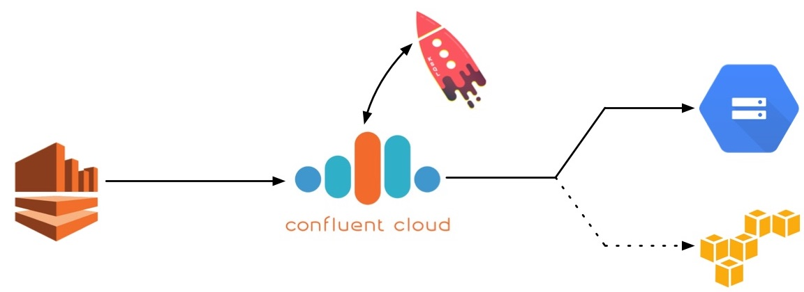

# Overview

This demo showcases a `AWS Kinesis -> Confluent Cloud -> cloud storage` pipeline.
You have freedom of choice in selecting the cloud storage provider that is right for your business needs.
Benefits of Confluent Cloud:

* Build business applications on a full event streaming platform
* Span multiple cloud providers (AWS, GCP, Azure) and on-prem datacenters
* Use Kafka to aggregate data in single source of truth
* Harness the power of [KSQL](https://www.confluent.io/product/ksql/)



# End-to-end Streaming ETL

This demo showcases an entire end-to-end streaming ETL deployment, built for 100% cloud services.
It is built on the |cp|, including:

* Kinesis source connector: reads from a Kinesis stream and writes the data to a Kafka topic
* KSQL: another variant of a fraud detection microservice
* GCS or S3 sink connector: pushes data from Kafka topics to cloud storage

+-------------------------------------+---------------------------+-------------------------+
| Other Clients                       | Consumes From             | Produces To             |
+=====================================+===========================+=========================+
| Kinesis source connector            | Kinesis stream `demo-s1`  | `kinesis-topic1`        |
+-------------------------------------+---------------------------+-------------------------+
| KSQL                                | `kinesis-topic1`          | KSQL streams and tables |
|                                     |                           | (see [ksql.commands](ksql.commands) |
+-------------------------------------+---------------------------+-------------------------+
| GCS (or S3) sink connector          | `COUNT_PER_CITY`,         | GCS (or S3)             |
|                                     | `SUM_PER_CITY`            |                         |
|                                     | (KSQL output streams)     |                         |
+-------------------------------------+---------------------------+-------------------------+


# Prerequisites

## Local

As with the other demos in this repo, you may run the entire demo end-to-end with `./start.sh`, and it runs on your local Confluent Platform install.  This requires the following:

* [Common demo prerequisites](https://github.com/confluentinc/examples#prerequisites)
* [Confluent Platform 5.2](https://www.confluent.io/download/)
* [An initialized Confluent Cloud cluster used for development only](https://confluent.cloud)
* GCS: `gsutils`
* AWS properly credentials configured on your host
* AWS CLI: `aws cli`
* `jq`
* `curl`


# Run the demo

1. Configure the cloud storage provider and other demo parameters in the `config/demo.cfg` file. In particular, be sure to configure the `DESTINATION_STORAGE` parameter appropriately for Google GCS or AWS S3, and set the appropriate region.

2. Run the demo:

```bash
$ ./start.sh
```

3. View all the Kinesis, Kafka, and cloud storage data after running the demo:

```bash
$ ./read-data.sh
```

4. Stop the demo and clean up:

```bash
$ ./stop.sh
```
